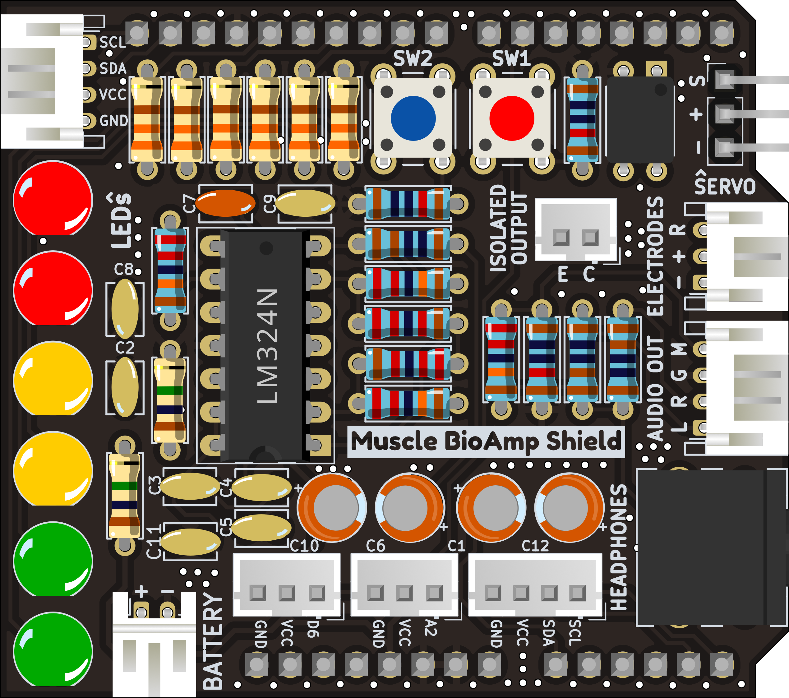
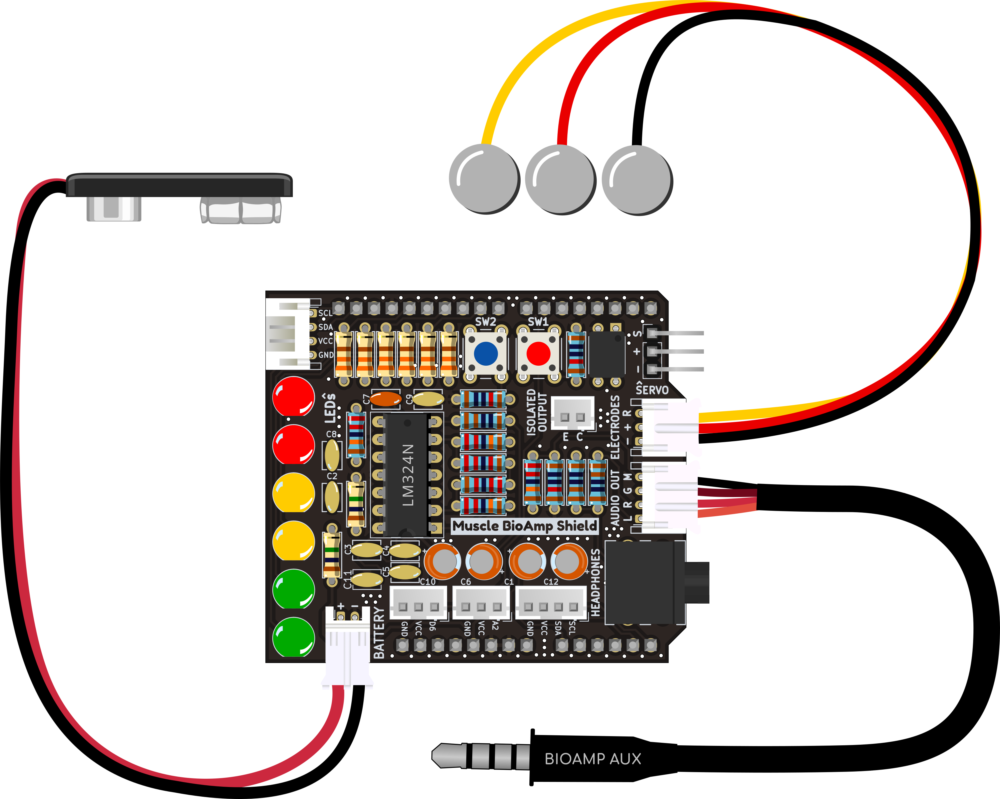
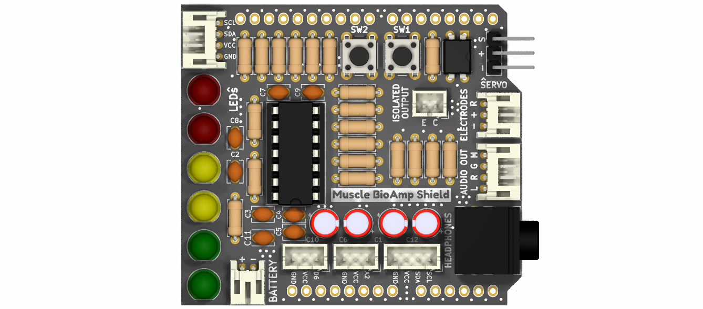

# Muscle BioAmp Shield

 
[-white)](https://store.upsidedownlabs.tech/product/muscle-bioamp-shield-v0-3/)

Muscle BioAmp Shield is an ElectroMyography (EMG) shield for learning neuroscience with ease. It is inspired from Back Yard Brains (BYB) Spiker shield and provides similar features like user buttons & LED Bar.

| Assembled | With cables & wires |
| :-------: | :--------: |
|  |  |

## Hardware

Muscle BioAmp Shield has been created using KiCad and all the design files can be found under [hardware](hardware/) folder, including [Interactive BOM](hardware/bom) file. Images below shows a quick overview of the hardware design.

## License

#### Hardware
CERN Open Hardware License Version 2 - Strongly Reciprocal ([CERN-OHL-S-2.0](https://spdx.org/licenses/CERN-OHL-S-2.0.html)).

#### Software
MIT open source [license](http://opensource.org/licenses/MIT).

#### Documentation:
 This work is licensed under a <a rel="license" href="http://creativecommons.org/licenses/by/4.0/">Creative Commons Attribution 4.0 International License</a>.