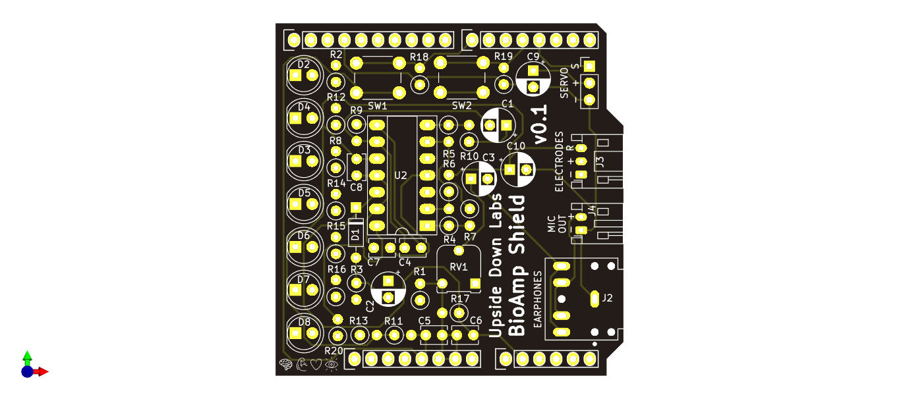
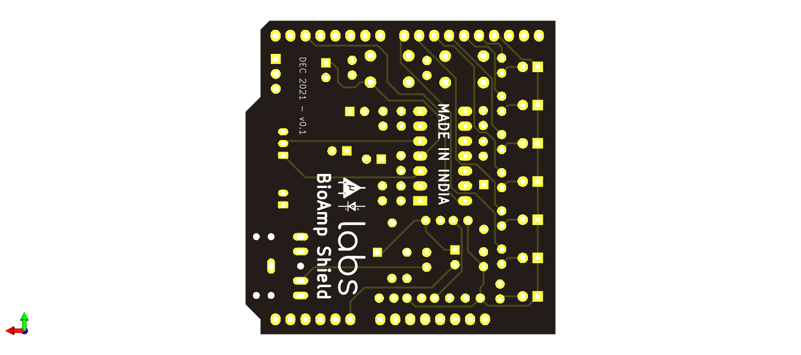
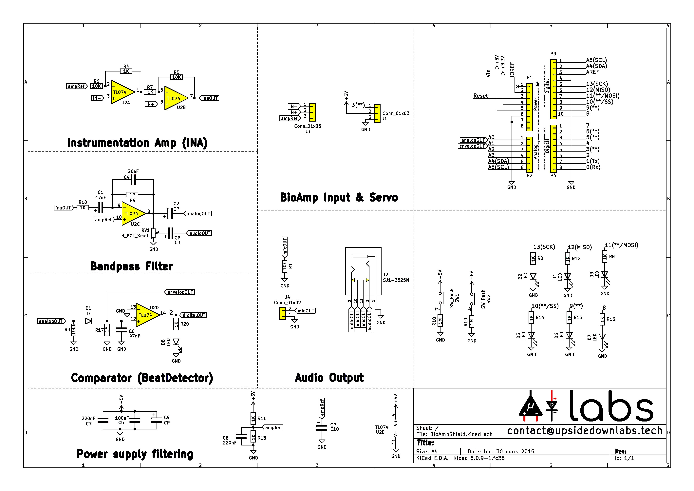

# Muscle BioAmp Shield
An Electromyography (EMG) shield for learning neauroscience with ease.

 

Note: This version was a limited quantity beta release with some issues. Don't use the design & docs of this version for any development.

## License

#### Hardware
CERN Open Hardware License Version 2 - Strongly Reciprocal ([CERN-OHL-S-2.0](https://spdx.org/licenses/CERN-OHL-S-2.0.html)).

#### Software
MIT open source [license](http://opensource.org/licenses/MIT).

#### Documentation:
 This work is licensed under a <a rel="license" href="http://creativecommons.org/licenses/by/4.0/">Creative Commons Attribution 4.0 International License</a>.