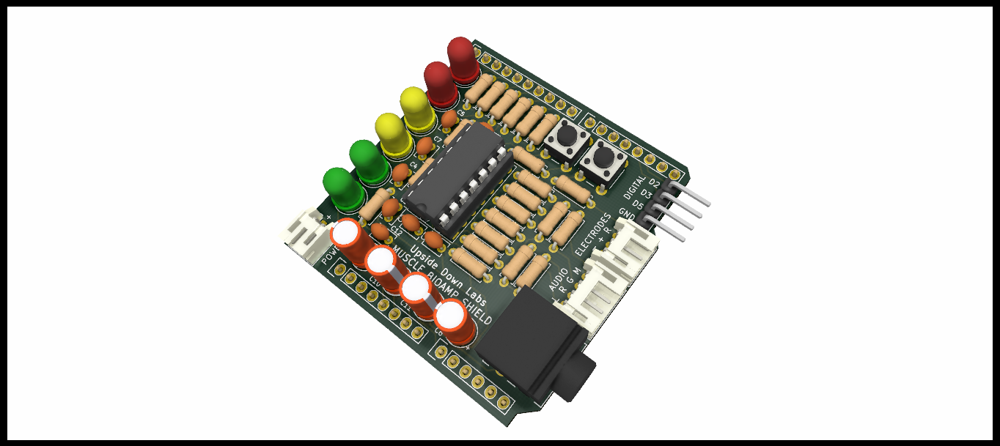

# Muscle BioAmp Shield

 
 
 

The Muscle BioAmp Shield is a piece of hardware specifically made for neuroscience enthusiasts and it is heavily inspired by the [DIY Muscle SpikerShield](https://backyardbrains.com/products/diyMuscleSpikerShield) from [BackYard Brains](https://backyardbrains.com/). It allows you to perform all the experiments that you can perform using the SpikerShield and even more. The Muscle BioAmp Shield allows you to record the signal via a direct connection from Arduino to PC and using Spike Recorder software on your Mobile & PC. You can visualize the EMG signal on the LED bank of the shield, it can also be done via the Spike Recorder App, and the Arduino serial plotter is also a good visualization software for the Muscle BioAmp Shield. You can also hear the signal using a pair of headphones or on a portable speaker using the audio cable provided with the Muscle BioAmp Shield. This is an all-in-one package for all the neuroscience enthusiasts out there looking for something affordable and fun!

| Assembled | With cables & wires |
| :-------: | :--------: |
|  |  |

## Hardware

Muscle BioAmp Shield has been created using KiCad and all the design files can be found under [hardware](hardware/) folder, including [Interactive BOM](hardware/bom) file. Images below shows a quick overview of the hardware design.

## License

#### Hardware
CERN Open Hardware License Version 2 - Strongly Reciprocal ([CERN-OHL-S-2.0](https://spdx.org/licenses/CERN-OHL-S-2.0.html)).

#### Software
MIT open source [license](http://opensource.org/licenses/MIT).

#### Documentation:
 This work is licensed under a <a rel="license" href="http://creativecommons.org/licenses/by/4.0/">Creative Commons Attribution 4.0 International License</a>.
